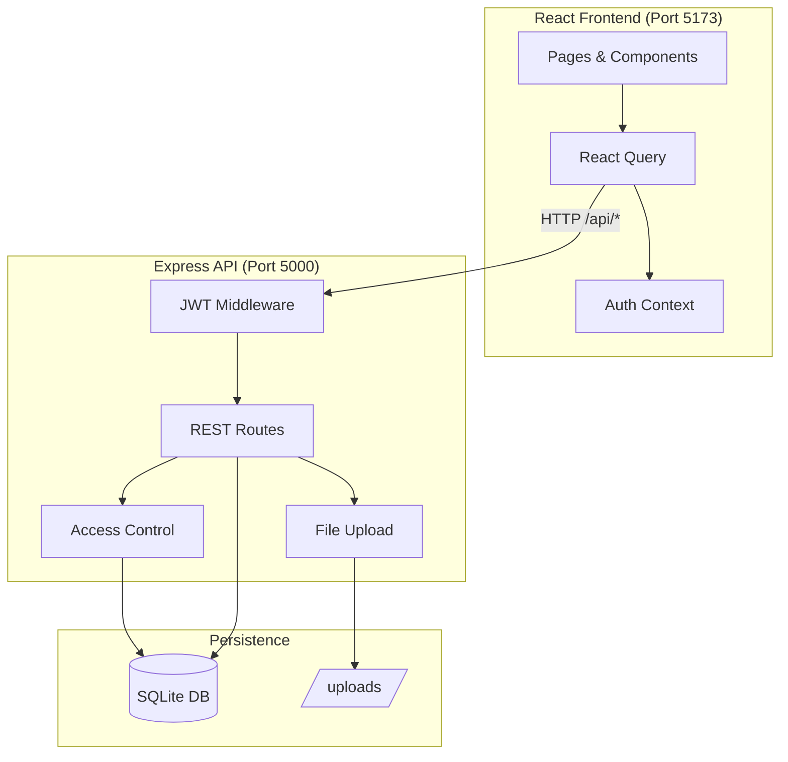

<<<<<<< HEAD
# 2care — Digital Health Wallet

A full-stack personal health wallet web application. Upload medical reports, track vitals over time with charts, search and filter records, and share selected reports with doctors, family, and friends.

## Tech Stack

| Layer | Technology |
|-------|------------|
| Frontend | React 18, Vite, Tailwind CSS, React Query, Recharts, React Router |
| Backend | Node.js, Express.js |
| Database | SQLite (better-sqlite3) |
| Auth | JWT + bcrypt |
| File Storage | Local filesystem (`backend/uploads/`) |

## Architecture



### Frontend
- **Pages:** Landing, Auth, Dashboard, Reports, Vitals, Sharing, Shared With Me
- **State:** React Context for auth; TanStack Query for server state
- **API:** Axios client with JWT interceptor and Vite dev proxy

### Backend
- **REST APIs** for auth, reports, vitals, shares, dashboard
- **JWT authentication** on all protected routes
- **Role-based access:** `owner` (full CRUD) vs `viewer` (read-only shared reports)

### Database Schema
- `users` — accounts with role (owner/viewer)
- `reports` — uploaded files + metadata
- `vitals` — time-series health metrics
- `shares` — report access grants (read-only)

## Prerequisites

- Node.js 18 or higher
- npm

## Setup & Run

### 1. Backend

```bash
cd backend
npm install
cp .env.example .env   # or use the included .env for local dev
npm run seed           # optional: demo data
npm run dev
```

API runs at **http://localhost:5000**

### 2. Frontend

```bash
cd frontend
npm install
npm run dev
```

App runs at **http://localhost:5173**

## Demo Accounts

After running `npm run seed` in backend:

| Role | Email | Password |
|------|-------|----------|
| Owner | owner@2care.demo | demo1234 |
| Doctor (Viewer) | doctor@2care.demo | demo1234 |
| Family (Viewer) | family@2care.demo | demo1234 |

The owner has sample vitals and shared reports pre-configured.

## API Documentation

Base URL: `http://localhost:5000/api`

### Auth

| Method | Endpoint | Description |
|--------|----------|-------------|
| POST | `/auth/register` | Register `{ name, email, password, role? }` |
| POST | `/auth/login` | Login `{ email, password }` → `{ user, token }` |
| GET | `/auth/me` | Current user (Bearer token) |

### Reports

| Method | Endpoint | Description |
|--------|----------|-------------|
| GET | `/reports/meta/types` | Report & vital type enums |
| GET | `/reports?dateFrom&dateTo&reportType&vitalType&search` | List reports |
| POST | `/reports` | Upload (multipart: `file`, `title`, `report_type`, `report_date`, `notes?`, `vitals?`) |
| GET | `/reports/:id` | Report detail |
| GET | `/reports/:id/download` | Download file |
| PATCH | `/reports/:id` | Update metadata (owner) |
| DELETE | `/reports/:id` | Delete report (owner) |

### Vitals

| Method | Endpoint | Description |
|--------|----------|-------------|
| GET | `/vitals/summary` | Latest value per vital type |
| GET | `/vitals/trends?vitalType&dateFrom&dateTo` | Chart data |
| GET | `/vitals?vitalType&dateFrom&dateTo` | List readings |
| POST | `/vitals` | Add reading |
| DELETE | `/vitals/:id` | Delete reading |

### Sharing

| Method | Endpoint | Description |
|--------|----------|-------------|
| GET | `/shares/sent` | Reports you've shared |
| GET | `/shares/received` | Reports shared with you |
| POST | `/shares` | `{ report_id, viewer_email }` |
| DELETE | `/shares/:id` | Revoke access |

### Users

| Method | Endpoint | Description |
|--------|----------|-------------|
| GET | `/users/dashboard` | Dashboard stats |
| GET | `/users/search?email=` | Find users to share with |

## Security

- **Passwords:** bcrypt hashed (cost factor 12)
- **Authentication:** JWT with configurable secret and expiry
- **Authorization:** Every report/vital query validates ownership or active share
- **File uploads:** MIME validation, 10MB limit, UUID filenames, served only via authenticated download endpoint
- **SQL injection:** Parameterized queries throughout
- **HTTP headers:** Helmet middleware
- **Rate limiting:** Auth routes limited to 30 requests per 15 minutes

## File Storage

Reports are stored locally at `backend/uploads/{userId}/{uuid}.{ext}`. For production, migrate to S3/Cloudinary with pre-signed URLs.

## Scalability Notes

- SQLite suits development and small deployments; migrate to PostgreSQL for multi-instance production
- Move file storage to cloud object storage
- Add Redis for session/token blocklist if needed
- Deploy frontend (Vercel/Netlify) and backend (Railway/Render) separately

## Project Structure

```
2care/
├── backend/          # Express API + SQLite
├── frontend/         # React SPA
└── README.md
```

## License

MIT
=======
# 2care-health-wallet
>>>>>>> 35652f9e482880be02ae7bc1f1d0b5cd4f75f80e
